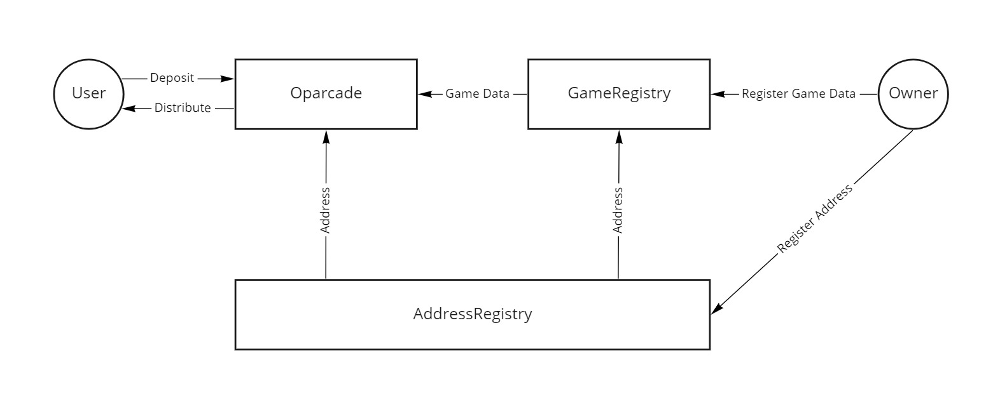

## Oparcade Smart Contract

### Developer instructions

#### Install dependencies
`yarn install`

#### Create .env file and make sure it's having following information:
```
ALCHEMY_KEY = YOUR_ALCHEMY_KEY
PK = YOUR_PRIVATE_KEY
ETHERSCAN_API_KEY = YOUR_ETHERSCAN_API_KEY
MUMBAI_DEPLOYER_ADDRESS = DEPLOYER_ADDRESS
MUMBAI_FEE_RECIPIENT_ADDRESS = FEE_RECIPIENT_ADDRESS
PLATFORM_FEE = (0, 1000]
TOURMANET_CREATION_FEE_TOKEN_ADDRESS = TOURNAMENT_CREATION_FEE_TOKEN_ADDRESS
TOURMANET_CREATION_FEE_TOKEN_AMOUNT = TOURNAMENT_CREATION_FEE_TOKEN_AMOUNT
```

#### Compile code
- `npx hardhat clean` (Clears the cache and deletes all artifacts)
- `yarn compile` (Compiles the entire project, building all artifacts)

#### Run tests
- `yarn test ./test/{desired_test_script}`

#### Deploy code 
- `npx hardhat node` (Starts a JSON-RPC server on top of Hardhat Network)
- `yarn run deploy:hardhat` (Deploy the contracts on Hardhat Network)
- `yarn run deploy:remote {network}` (Deploy the contracts on the Mainnet or Testnet)

#### Etherscan verification
- `npx hardhat --network {network} etherscan-verify --api-key {etherscan_api_key}`

### How it works


The games must be added by the DAO and the game creators need to provide their wallet addresses to which the game creator royalty will be transferred. The DAO and the game creator need to discuss the minimum game creator royalty and agree on it. The game creator wallet address and the minimum game creator royalty can be updated later.

If the game is added, the tournament can be created by the DAO or community for the game.
The tournament creator can create the tournament by specifying the buy-in amount and winner prizes and also initiate the additional prize pool with his assets.
The buy-in token will be specified by ERC20 token and the prize can be composed of ERC20, ERC721 and ERC1155 tokens.

The total income of the tournament is the sum of buy-in and the prize pool and all is distributed to the winners, the game creator and the tournament creator. When distributing, some fees will be deducted.

In case the tournament is created by the community, it's not allowed to change the tournament info such as buy-in, prize pool, fee, etc to protect the players.

#### Manage Games
** NOTE **: Only owner can manage games.

The first step is to add/remove games users can play.

````solidity
function addGame(string memory _gameName, address _gameCreator, uint256 _baseGameCreatorFee) external onlyOwner returns (uint256 gid);
function removeGame(uint256 _gid) external onlyOwner;
````

The second step is to add tokens available for the deposit of each tournament. If the tournament is created by the community, this step is skipped.

````solidity
function updateDepositTokenAmount(
    uint256 _gid,
    address _token,
    uint256 _amount
) external onlyOwner;
````

The third step is to add tokens available for the distribution of each game. If the tournament is created by the community, this step is skipped.

````solidity
function updateDistributableTokenAddress(
    uint256 _gid,
    address _token,
    bool _isDistributable
) external onlyOwner;
````

#### Manage tournaments

After the game is added, the next step is to create the tournament.

````solidity
function createTournamentByDAO(
    uint256 _gid,
    uint256 _proposedGameCreatorFee,
    uint256 _tournamentCreatorFee
) external onlyOwner returns (uint256 tid);
````

````solidity
function createTournamentByUser(
    uint256 _gid,
    uint256 _proposedGameCreatorFee,
    uint256 _tournamentCreatorFee,
    address _depositTokenAddress,
    uint256 _depositTokenAmount,
    address _tokenToAddPrizePool,
    uint256 _amountToAddPrizePool,
    address _nftAddressToAddPrizePool,
    uint256 _nftTypeToAddPrizePool,
    uint256[] memory _tokenIdsToAddPrizePool,
    uint256[] memory _amountsToAddPrizePool
) external returns (uint256 tid);
````

#### Deposit tokens

After the tournament is created, users can buy-in to participate in the tournament.

````solidity
function deposit(uint256 _gid, uint256 _tid, address _token) external;
````

#### Distribute prizes

If the tournament is ended, the prizes will be distributed to the winners by the game server based on the tournament result. The prize can be composed of ERC20, ERC721 and ERC1155 tokens and it will be transferred to the winners' wallets automatically.

````solidity
function distributePrize(
    uint256 _gid,
    uint256 _tid,
    address[] calldata _winners,
    address _token,
    uint256[] calldata _amounts
) external onlyMaintainer;
````

````solidity
function distributeNFTPrize(
    uint256 _gid,
    uint256 _tid,
    address[] calldata _winners,
    address _nftAddress,
    uint256 _nftType,
    uint256[] calldata _tokenIds,
    uint256[] calldata _amounts
) external onlyMaintainer;
````
